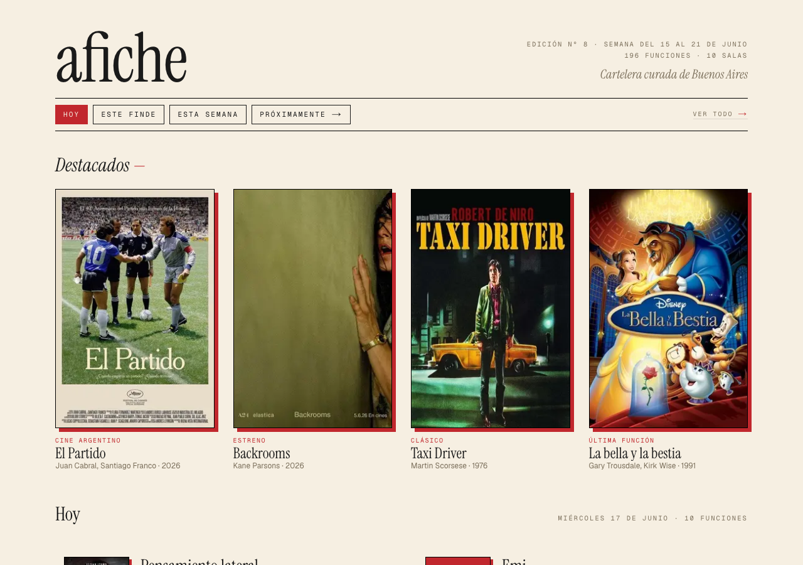
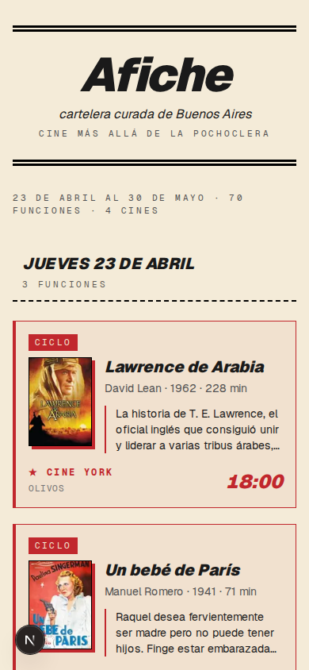
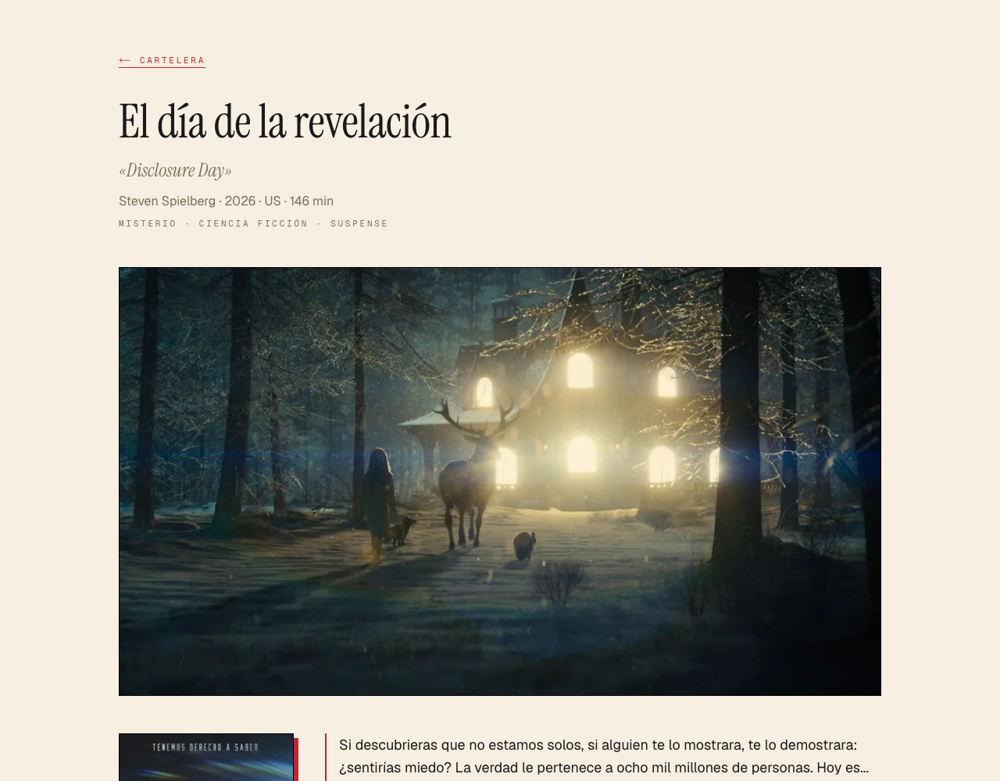
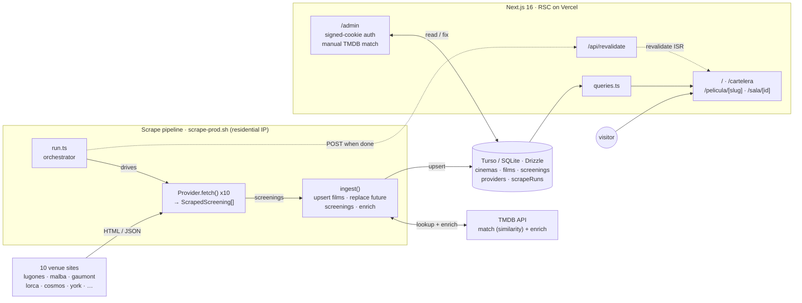

# afiche

**Cartelera curada de Buenos Aires**

afiche pulls the weekly programming of Buenos Aires' independent and repertory cinemas into one clean, editorial-feel cartelera — one screen for the whole indie circuit, built for people who already know the difference between a Saturday at Lugones and a Saturday at Hoyts. **Live at [afiche.ar](https://afiche.ar)** — Next.js on Vercel, libSQL on Turso.

  

## What it does

- **One row per film, scoped to a time window.** The homepage groups every screening by *film* (not showtime) for a relative window — **Hoy** (default), **Este finde**, **Esta semana**, **Próximamente** — switchable via `?ventana=hoy|finde|semana|prox` (shareable; an unknown value falls back to `hoy`). A single-showtime film renders an inline `time · venue`; a multi-showtime film collapses to a `{n} funciones · {venue}` summary that taps open. Prod data earns the layout: 64% of films have one showtime all week and 95% play a single venue, so the common row is one clean line.
- **A curated "Destacados" band.** Above the film grid sits a full-bleed row of 0–4 hand-picked poster cards. Curation is visible, not buried behind a toggle.
- **An exhaustive day-by-day view at `/cartelera`.** One tap from the homepage ("Ver todo →"): a 14-day rolling window of full cards grouped by day, a sticky date strip, and a *Próximamente* text index for the longer tail.
- **Per-film pages with cross-venue discovery.** `/pelicula/<slug>` gives each film a title block, an optional 16:9 editorial still, poster, synopsis, top-billed cast — and the killer feature: every upcoming screening of that film across BA, in one list. It answers "when *else* can I catch this?", which no single venue's own site can.
- **Rich, deduplicated film cards.** Each film is enriched from TMDB (poster, backdrop, director, runtime, country, original title, Spanish synopsis, genres, cast). The same film surfacing with title drift across cinemas collapses to one entry, and a title-ambiguity guard keeps the three *Nosferatu*s apart.

## What it doesn't do (yet)

- **No search or filters** — the cartelera *is* the index. Search (title + director) is queued behind /pelicula/ usage data.
- **No per-cinema programming pages**, and no `/programa/<slug>` pages for curated cycles (Lugones Olivera-Aries, MALBA Cineclub Nocturna). Cycles are denormalized text on screenings for now.
- **No chains.** afiche covers the indie / repertory circuit only; Cinépolis and the multiplexes are intentionally out. This is the indie-circuit cartelera, not all of BA cinema.
- **No dark mode** — the editorial cream + carmine palette is the brand.

## Cinemas covered

| Cinema | Neighborhood | Type | Source |
|---|---|---|---|
| Sala Leopoldo Lugones | San Nicolás | indie / repertory | complejoteatral.gob.ar |
| MALBA | Palermo | indie / museum | malba.org.ar |
| Cine Lorca | San Nicolás | indie / repertory | cinelorca.wixsite.com (VLM-extracted poster) |
| Cine Cosmos | Balvanera | indie / repertory | cinecosmos.uba.ar |
| Cine York | Olivos | indie / repertory | lumiton.ar |
| Centro Cultural Munro | Munro | indie / community | lumiton.ar |
| Lumiton | Munro | indie / museum | lumiton.ar |
| Cine Gaumont | San Nicolás | indie / repertory (INCAA) | cinegaumont.ar |
| CineArte Cacodelphia | San Nicolás | indie / repertory | cineartecacodelphia.com.ar (adro.studio JSON API) |
| Centro Cultural Borges | San Nicolás | indie / cultural center | centroculturalborges.gob.ar |

## Architecture

**Getting data in.** There's no cloud cron. `scrape-prod.sh` runs from a residential IP on the dev machine, because lumiton.ar and complejoteatral.gob.ar 403 datacenter IPs and a GitHub Actions runner can't reach them. It walks all 10 providers (`src/scrapers/run.ts`) and ingests each through `src/scrapers/ingest.ts` — upsert films → replace that cinema's future screenings → TMDB-enrich. Every provider is pure `() → ScrapedScreening[]`. Three of the ten (Cine York, Munro, Lumiton) share `lumiton-agenda.ts` because one Lumiton agenda page drives all three venues; Cine Lorca has no HTML schedule at all — its week lives on a single poster image, so its provider hashes the image and, on a cache miss, runs a Claude vision call (`temperature: 0`, structured JSON) to read the showtimes.

**Staying correct.** Ingest is idempotent (unique index on `(scraped_title, scraped_year)`) and self-healing. A film that shows up with title drift across cinemas — different localizations, year-null collisions — collapses to one row keyed on `tmdb_id` after enrichment, and a title-ambiguity guard plus director verification stop silent wrong-matches on common titles (the *Nosferatu* class: Eggers 2024 vs Herzog 1979 vs Murnau 1922 all share a Spanish title). Each run records one `scrape_runs` row per `(cinema, run)` with status + counts; when it finishes, `scrape-prod.sh` POSTs `/api/revalidate` so the deployed pages pick up the fresh data.

**Getting data out.** Every serving route reads the same DB through `src/db/queries.ts`. The homepage (`src/app/page.tsx`) calls `getWindowScreeningsByFilm` (one row per film, bounded by `?ventana=`), `getFeaturedFilms` (the *Destacados* band), and `getJsonLdScreenings` (structured-data feed). `/cartelera` (`src/app/cartelera/page.tsx`) calls `getTwoWeeksScreenings` (the 14-day window), `getUpcomingScreenings` (*Próximamente*), and `getLastScreeningPerFilm` (the ÚLTIMA FUNCIÓN anchor). `/pelicula/[slug]` calls `getUpcomingScreeningsByFilm` for the cross-venue list. The window registry (`src/lib/windows.ts`) is the single source for the nav, the `?ventana=` validation, and the bounded query.

## Tech stack

- **Next.js 16** — App Router, React Server Components, `force-dynamic` on the cartelera + film pages
- **React 19 + Tailwind CSS 4** — design tokens via `@theme` (see [DESIGN.md](DESIGN.md))
- **Type** — Geist (body) + Geist Mono (eyebrows, caps) + Instrument Serif (masthead, day banners, film titles, italic time accents)
- **Drizzle ORM + libSQL** — SQLite locally, Turso in production
- **cheerio** for HTML scraping; **Claude vision** (`claude-sonnet-4-6`) for Cine Lorca's image-only poster, image-hash cached
- **TMDB API** for film metadata, posters, and editorial stills
- **Vitest** — ~645 tests across 35 files (scraper providers, ingest, TMDB enrichment, date/window helpers, layout invariants); fixtures are real HTML captures, so tests never hit the network or burn vision credits
- **Vercel** for hosting + ISR revalidation

## Credits

afiche uses the TMDB API but is not endorsed or certified by TMDB. [TMDB](https://www.themoviedb.org) provides the film metadata, poster images, and editorial stills rendered alongside each screening. afiche hotlinks TMDB's CDN (`image.tmdb.org/t/p/...`) rather than re-hosting, per TMDB's best-practice guidance, and never resells or commercially redistributes TMDB data. Cine Lorca's image-only weekly programming is read via [Anthropic's Claude](https://www.anthropic.com/) vision API; the image is hashed and the result cached locally, so a given poster is parsed at most once.

## License

Licensed under the [PolyForm Noncommercial License 1.0.0](LICENSE.md) (source-available). Noncommercial use is permitted; commercial use is reserved to the author.

---

Built by [Benjamin Delasoie](https://github.com/benjamindelasoie). Spot a screening afiche missed or got wrong? Issues welcome.
