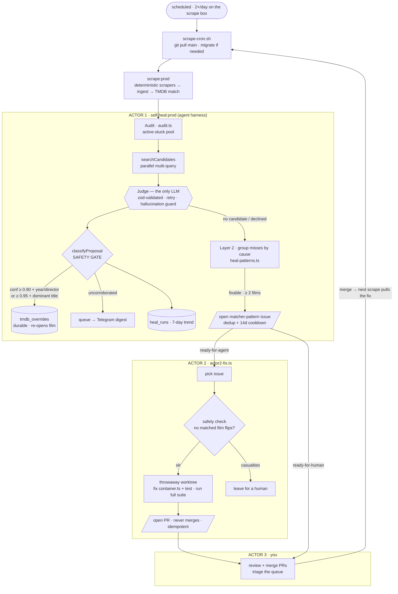

# Self-heal loop

The scraper enriches films deterministically (TMDB match). Some films still miss.
This loop enriches the miss with an agent, and improves the deterministic code so
the miss shrinks over time. Three actors, two layers.

## Architecture

The design is one idea: a **deterministic harness around a single narrow LLM call**.
The model (the judge) only *proposes*; the harness *decides and writes*. Every write
(DB overrides, GitHub issues, PRs) is plain, tested code with no model in the loop.

The loop closes at the bottom edge: you merge a fix, the next scrape's `git pull`
picks it up, and the tail is smaller — the deterministic layer converges over time.

## Layer 1 — heal the data (runs after every scrape)

`scripts/self-heal.ts` (`npm run db:self-heal:prod -- --write`) runs on the scrape
host after each scrape, pass or fail.

1. Audit the last runs (`src/scrapers/audit.ts`): alerts + the active-stuck pool
   (no TMDB match, a future screening, not `skipTmdb`, not `hiddenAt`).
2. Judge each stuck film against TMDB candidates (the existing SDK judge).
3. Auto-apply only matches that clear the safety gate (`src/scrapers/self-heal.ts`,
   `classifyProposal`). A match auto-applies when it is candidate-judged AND either:
   - confidence >= 0.90 and the year or director corroborates, or
   - confidence >= 0.95 and the scraped title is an exact, dominant, established
     match (normalizes-equal to the candidate title/original, outweighs any
     same-title rival by >= 4x votes, vote_count >= 100), with no year/director
     that actively disagrees.
   A web-researched id NEVER auto-applies.
4. The apply is a durable row in `tmdb_overrides` (survives `reset-programming`) and
   re-opens the film for the next enrich. Everything else goes to the digest queue.

## Layer 2 — catch the bug (same run)

`src/scrapers/heal-patterns.ts` groups the films that STILL missed by fixable cause.
A cause that explains >= 2 films opens a `matcher-pattern` GitHub issue (the harness
opens it, not the model — issue creation is a write credential). Dedup is by a
signature marker in the issue body, so a cause is filed once.

- `container-or-placeholder` → `ready-for-agent` (mechanical: a new skip word).
- `localized-title-miss` → `ready-for-human` (the Spanish title diverges from TMDB).
- `unfixable` (not in TMDB) never files.

## Actor 2 — fix the bug (chained after self-heal)

`scripts/actor2-fix.ts` (`npm run actor2:fix:prod`) runs after self-heal on the
same box and consumes the first `ready-for-agent` `matcher-pattern` issue:

1. Parse the failing titles, compute the mechanical fix
   (`src/scrapers/container-suggest.ts`).
2. Safety check: mirror production (`isNonFilmContainer` on the noise-stripped
   title) and confirm NO already-matched film flips to skip. Abort if any would.
3. In a throwaway git worktree (never the live checkout): edit
   `src/tmdb/container.ts` + a regression test, run the full suite.
4. Open a PR that closes the issue and stop. **Actor 2 never merges** — the PR
   waits for a human, and the run is idempotent: if a PR for that branch exists in
   any state (open, merged, closed), the issue is skipped, so the cron cannot spam.
   `ready-for-human` issues (localized-title misses) are never auto-fixed.

Requires `gh auth login` (repo scope) once on the box — without it, issue/PR calls
no-op and the loop stalls at "file the issue".

## Actor 3 — you

Every merge is yours. Actor 2 leaves a PR with a green suite and a safety check that
proved no already-matched film flips to skip; you read it and merge (or `git revert`
later if it was wrong). You also triage the digest queue — the uncorroborated
proposals — with a fix or a skip-forever. Merge, and the next scrape's `git pull`
picks the fix up.

## Kill switches

Each stage reads an env flag (`src/lib/flags.ts`), default ON, OFF only on an
explicit falsy value (`0/false/off/no`) — so a stage can be paused on the box
without a code change or a cron edit:

| Flag | Pauses |
|---|---|
| `SELF_HEAL_ENABLED` | the whole self-heal run |
| `SELF_HEAL_APPLY_ENABLED` | auto-applying overrides (judge + queue only) |
| `LAYER2_ISSUES_ENABLED` | opening matcher-pattern issues |
| `ACTOR2_ENABLED` | the Actor 2 fix automation |
